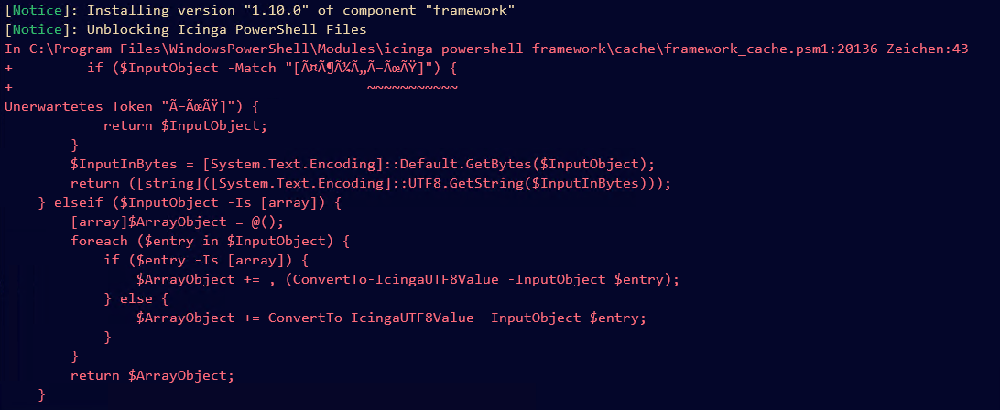

# Icinga Knowledge Base - IWKB000014

## Short Message

Installing or Updating Icinga for Windows causes error messages regarding `framework_cache.psm1` errors.

## Example Exception



## Reason

This or a similar error can happen, if for some reason the `framework_cache.psm1` is corrupted during the installation or update.

While upgrading from older versions to `v1.10.0`, this is an `expected` error, because of various changes we made and notified about in the [Upgrading Docs](../100-General/01-Upgrading.md).

## Solution

To resolve this issue, we simply require to reset the `framework_cache.psm1`. Starting with Icinga for Windows v1.10.0, there is a template available we can copy over the current file and resetting the state. As we assume in this, that your Icinga for Windows installation is already broken, we use native PowerShell tools instead of Icinga for Windows tools.

Use the following code snippet to repair your installation within an `administrative PowerShell`:

```powershell
[array]$FrameworkModule = Get-Module -ListAvailable -Name 'icinga-powershell-framework';
[string]$TemplateCache  = Join-Path `
    -Path $FrameworkModule[0].ModuleBase `
    -ChildPath 'templates\framework_cache.psm1.template';
[string]$FrameworkCache = Join-Path `
    -Path $FrameworkModule[0].ModuleBase `
    -ChildPath 'cache\framework_cache.psm1';

Copy-Item -Path $TemplateCache -Destination $FrameworkCache -Force;

Import-Module -Name 'icinga-powershell-framework' -Force;
Import-Module -Name 'icinga-powershell-framework' -Global -Force;

icinga { Write-Host 'Icinga for Windows successfully repaired' };

Restart-IcingaWindowsService;
```

Once executed, Icinga for Windows should rebuild the cache and work again as intended. Please keep the `icinga` call within the example, as this will ensure that possible pending migrations of Icinga for Windows will be applied.
